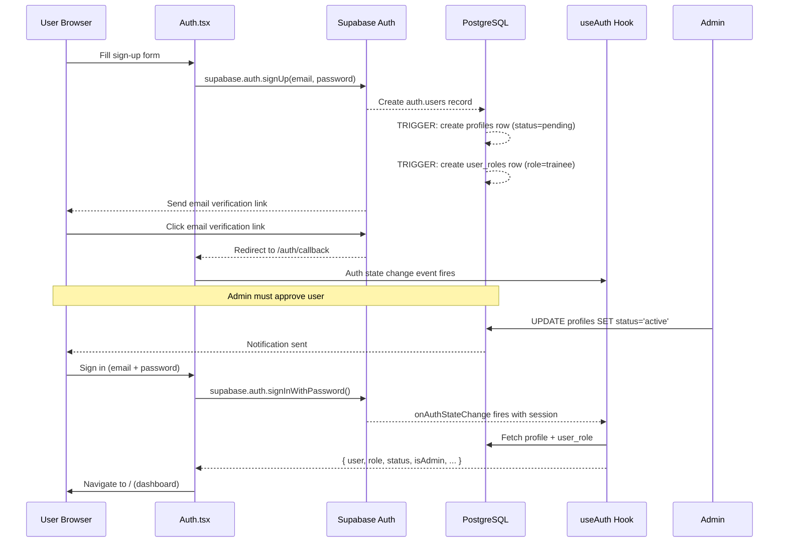
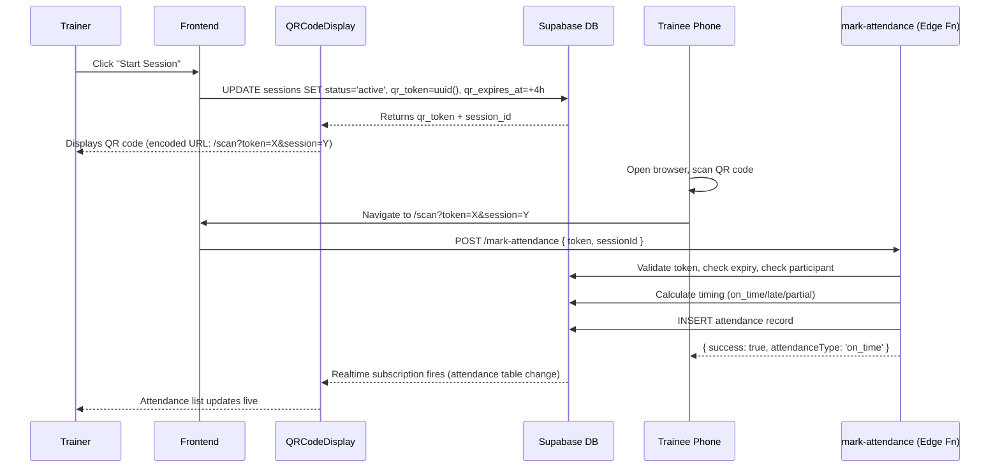
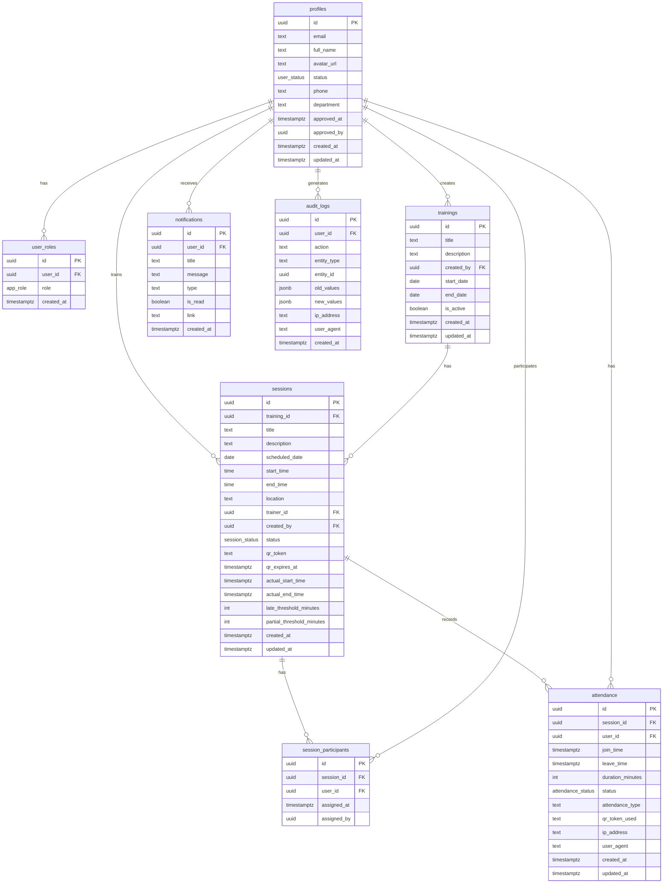

# Health Insights Hub — Complete KT & Handover Document

> **Document Version:** 1.0  
> **Prepared On:** 2026-05-07  
> **Prepared By:** Senior Architect Review  
> **Audience:** Incoming Development Team  
> **Confidentiality:** Internal Use Only

---

## Table of Contents

1. [Executive Summary](#1-executive-summary)
2. [Project Overview](#2-project-overview)
3. [Repository Overview](#3-repository-overview)
4. [System Architecture](#4-system-architecture)
5. [Tech Stack](#5-tech-stack)
6. [Setup & Installation Guide](#6-setup--installation-guide)
7. [API Documentation](#7-api-documentation)
8. [Database Documentation](#8-database-documentation)
9. [Authentication & Authorization](#9-authentication--authorization)
10. [Deployment Architecture](#10-deployment-architecture)
11. [Third-Party Integrations](#11-third-party-integrations)
12. [Code Flow Explanation](#12-code-flow-explanation)
13. [Important Modules Breakdown](#13-important-modules-breakdown)
14. [Risks / Technical Debt / Known Issues](#14-risks--technical-debt--known-issues)
15. [Recommendations](#15-recommendations)
16. [Handover Notes](#16-handover-notes)
17. [Developer Onboarding Guide](#17-developer-onboarding-guide)
18. [Quick Start Guide](#18-quick-start-guide)
19. [Production Deployment Checklist](#19-production-deployment-checklist)
20. [Repository Mind Map](#20-repository-mind-map)

---

## 1. Executive Summary

**Health Insights Hub** is a full-stack **Training Management & Attendance Tracking Platform** built for organizations that need to manage structured training programs for their workforce. The platform is also branded as **"MindBody Insights"** in the mobile app configuration and **"Aura"** in some UI references.

The system supports three user roles — **Admin**, **Trainer**, and **Trainee** — each with distinct capabilities. The standout feature is a **QR code-based attendance system** where trainers display a time-limited QR code during a live session, and trainees scan it to register attendance. The system automatically classifies attendance as on-time, late, or partial based on configurable time thresholds.

The application is a **React 18 + TypeScript** single-page application using **Supabase** as a fully managed backend (PostgreSQL database, Auth, and serverless Edge Functions). It is deployed via **Vercel** and has **Capacitor** wiring for future iOS/Android mobile app distribution.

**Key Numbers at a Glance:**

| Metric | Detail |
|---|---|
| Frontend Framework | React 18 + TypeScript + Vite |
| Backend | Supabase (PostgreSQL + Auth + Edge Functions) |
| Database Tables | 8 core tables |
| Edge Functions (APIs) | 8 serverless endpoints |
| User Roles | 3 (Admin, Trainer, Trainee) |
| Pages / Routes | 10 routes |
| Deployment | Vercel + Supabase Cloud |
| Mobile Support | Capacitor (iOS / Android — partially configured) |

---

## 2. Project Overview

### 2.1 Project Name

**Health Insights Hub** (also referenced as *MindBody Insights* and *Aura*)

### 2.2 Purpose of the Application

A corporate **Training & Attendance Management System** that enables organizations to:

- Create and schedule training programs and individual sessions
- Manage trainer and trainee enrollment
- Track attendance automatically via QR codes or manually
- Generate attendance and performance analytics
- Administer user accounts with role-based access control

### 2.3 Business Problem Solved

Organizations running structured training programs (corporate learning, fitness coaching, wellness programs, or professional development) face challenges in:

- Manually tracking who attended which session
- Ensuring trainers can verify attendance without paper sign-in sheets
- Giving management visibility into training completion rates
- Handling self-enrollment workflows

This platform digitizes and automates the entire training lifecycle — from creation to attendance to reporting.

### 2.4 High-Level Functionality

```
Admin        → Manages users, approves registrations, views reports
Trainer      → Creates programs, runs sessions, marks attendance
Trainee      → Enrolls in sessions, scans QR for attendance, views history
System       → Auto-completes sessions, sends notifications, enforces RLS
```

### 2.5 Main Users / Stakeholders

| Role | Responsibilities |
|---|---|
| **Admin** | System administrator — user approvals, full data access, reports |
| **Trainer** | Content creator — manages training programs and live sessions |
| **Trainee** | End learner — enrolls in sessions and attends them |

### 2.6 Core Features

- **User Registration & Approval Flow** — Trainees register, Admins approve/reject
- **Role-Based Access Control** — Three distinct roles with strict RLS enforcement
- **Training Program Management** — Create multi-session training programs
- **QR Code Attendance** — Time-limited QR tokens for live session check-in
- **Manual Attendance** — Admins/Trainers can override attendance status
- **Real-Time Attendance Updates** — Live attendance list during active sessions
- **Self-Enrollment** — Trainees browse and join open training programs
- **Join Request Workflow** — Trainees request to join; Trainers approve
- **Analytics & Reports** — Attendance distribution charts, CSV export
- **Notification System** — In-app notifications for key events
- **User Management** — Admin panel for role assignment, status changes, password reset
- **Dark / Light Mode** — Full theme support

---

## 3. Repository Overview

### 3.1 Root Directory Structure

```
health-insights-hub/
│
├── src/                          # All frontend source code
│   ├── pages/                    # One file per route/page
│   ├── components/               # Reusable React components
│   │   ├── dashboards/           # Role-specific dashboard views
│   │   ├── training/             # Training & session management
│   │   ├── attendance/           # QR code display & scanning
│   │   ├── notifications/        # Notification inbox
│   │   ├── auth/                 # Auth-specific UI components
│   │   ├── user/                 # User management components
│   │   └── ui/                   # shadcn-ui base components (80+ files)
│   ├── hooks/                    # Custom React hooks
│   ├── integrations/
│   │   └── supabase/             # Supabase client + auto-generated types
│   ├── types/                    # TypeScript type definitions
│   ├── lib/                      # Shared utilities
│   ├── App.tsx                   # Root component with Router & providers
│   ├── main.tsx                  # React entry point
│   ├── index.css                 # Global CSS / design tokens
│   └── vite-env.d.ts             # Vite env type shims
│
├── supabase/                     # Backend (Supabase)
│   ├── functions/                # Edge Functions (serverless APIs)
│   │   ├── mark-attendance/      # QR scan → attendance record
│   │   ├── set-attendance/       # Manual attendance marking
│   │   ├── auto-complete-sessions/ # Auto-close expired sessions
│   │   ├── admin-reset-password/ # Admin password reset
│   │   ├── create-admin/         # Bootstrap admin user
│   │   ├── delete-user/          # Delete user account
│   │   ├── send-notification/    # Insert notification record
│   │   └── process-attendance-request/ # Approve/reject join requests
│   ├── migrations/               # SQL migration files (versioned)
│   └── config.toml               # Supabase project configuration
│
├── public/                       # Static assets (favicon, etc.)
├── dist/                         # Production build output (git-ignored)
│
├── .env                          # Environment variables (never commit)
├── package.json                  # NPM dependencies & scripts
├── vite.config.ts                # Vite build & dev server config
├── tailwind.config.ts            # Tailwind CSS design system config
├── tsconfig.json                 # TypeScript root config
├── tsconfig.app.json             # App-specific TS config
├── postcss.config.js             # PostCSS (autoprefixer)
├── components.json               # shadcn-ui CLI configuration
├── capacitor.config.ts           # Mobile app configuration
├── vercel.json                   # Vercel deployment rewrites
└── eslint.config.js              # ESLint linting rules
```

### 3.2 Folder Responsibilities

| Folder / File | Responsibility |
|---|---|
| `src/pages/` | One component per URL route. Thin pages — they import components and orchestrate layout |
| `src/components/dashboards/` | Role-specific dashboard views (Admin, Trainer, Trainee). Conditionally rendered from `Index.tsx` |
| `src/components/training/` | All training program and session CRUD, forms, calendars, participant management |
| `src/components/attendance/` | QR code generator display (`QRCodeDisplay`) and QR scanner (`QRScanner`) |
| `src/components/notifications/` | In-app notification inbox component |
| `src/components/auth/` | Auth-specific helpers (e.g., `PasswordStrengthIndicator`) |
| `src/components/user/` | User admin components (e.g., `CategoryAssignment`) |
| `src/components/ui/` | All shadcn-ui primitives — do NOT modify directly; regenerate via shadcn CLI |
| `src/hooks/` | Custom hooks — authentication state, real-time subscriptions, pagination, mobile detection |
| `src/integrations/supabase/` | Supabase client singleton (`client.ts`) and database type definitions (`types.ts`) |
| `src/types/auth.ts` | Application-level TypeScript interfaces (Profile, UserRole, Session, Attendance, etc.) |
| `src/lib/utils.ts` | `cn()` utility for conditional Tailwind class merging |
| `supabase/functions/` | Serverless Deno edge functions; each folder is one deployed function |
| `supabase/migrations/` | Versioned SQL files for database schema evolution — never edit existing files |

### 3.3 Important Files

| File | What It Does |
|---|---|
| `src/App.tsx` | Defines all client-side routes, wraps app in `QueryClientProvider` and `ThemeProvider` |
| `src/pages/Index.tsx` | Entry point after login — dispatches to Admin/Trainer/Trainee dashboard based on role |
| `src/hooks/useAuth.ts` | **Central auth state** — every component uses this to get user, role, status |
| `src/integrations/supabase/client.ts` | Supabase client initialization with URL + anon key from env vars |
| `src/integrations/supabase/types.ts` | Auto-generated DB types (regenerate after schema changes with Supabase CLI) |
| `supabase/functions/mark-attendance/index.ts` | Core QR attendance logic with timing classification |
| `supabase/migrations/20251226063647_*.sql` | Initial full schema — all tables, enums, RLS policies, triggers |
| `vite.config.ts` | Proxies `/api/supabase/*` to Supabase URL during development |
| `vercel.json` | Rewrites `/api/supabase/*` in production + SPA fallback (`/* → /index.html`) |
| `.env` | Supabase project credentials — required for both dev and prod |

### 3.4 Configuration Files

| File | Key Settings |
|---|---|
| `.env` | `VITE_SUPABASE_URL`, `VITE_SUPABASE_PUBLISHABLE_KEY`, `VITE_SUPABASE_PROJECT_ID` |
| `vite.config.ts` | Dev proxy `/api/supabase` → Supabase URL; `@` alias → `./src`; dev port `8080` |
| `vercel.json` | Production proxy rewrite for Supabase; SPA fallback route |
| `tailwind.config.ts` | Custom color tokens (HSL), animation plugins, dark mode via `class` |
| `components.json` | shadcn-ui path aliases, style (default), Tailwind integration |
| `capacitor.config.ts` | Mobile app ID, name, web directory, live reload server URL |
| `supabase/config.toml` | Supabase project ID, edge function settings (`verify_jwt = false` for all functions — auth handled inside each function) |

---

## 4. System Architecture

### 4.1 Overall Architecture

This is a **frontend-heavy SPA with a Backend-as-a-Service (BaaS)** architecture. There is no custom backend server — Supabase provides the database, authentication, real-time subscriptions, and serverless compute.

```
┌────────────────────────────────────────────────────────────┐
│                        BROWSER / APP                       │
│                                                            │
│   React 18 SPA (Vite)                                      │
│   ┌──────────┐  ┌──────────┐  ┌──────────┐  ┌──────────┐  │
│   │  Pages   │  │Components│  │  Hooks   │  │  Types   │  │
│   └────┬─────┘  └────┬─────┘  └────┬─────┘  └──────────┘  │
│        └─────────────┴─────────────┘                       │
│                       │                                    │
│              Supabase JS Client                            │
│         (src/integrations/supabase/client.ts)              │
└───────────────────────┬────────────────────────────────────┘
                        │  HTTPS / WebSocket
          ┌─────────────▼──────────────────┐
          │        SUPABASE CLOUD          │
          │                                │
          │  ┌──────────┐ ┌─────────────┐  │
          │  │ PostgREST│ │  Auth (JWT) │  │
          │  │  (REST)  │ │  + GoTrue   │  │
          │  └──────────┘ └─────────────┘  │
          │                                │
          │  ┌──────────┐ ┌─────────────┐  │
          │  │ Realtime │ │    Edge     │  │
          │  │ (WS/SSE) │ │  Functions  │  │
          │  └──────────┘ │  (Deno)     │  │
          │               └─────────────┘  │
          │                                │
          │  ┌──────────────────────────┐   │
          │  │   PostgreSQL Database    │   │
          │  │   (with RLS Policies)    │   │
          │  └──────────────────────────┘   │
          └────────────────────────────────┘
```

### 4.2 Frontend Architecture

The frontend follows a **page-centric component architecture**:

- **Pages** (`src/pages/`) are the top-level route components. They are thin orchestrators.
- **Feature Components** (`src/components/training/`, `attendance/`, etc.) contain the real logic.
- **UI Components** (`src/components/ui/`) are dumb, stateless, reusable primitives from shadcn-ui.
- **Hooks** (`src/hooks/`) encapsulate all stateful logic — auth, real-time, pagination.

**State Management:**
- No global state library (no Redux, Zustand, etc.)
- Auth state lives in `useAuth` hook (Supabase session)
- Component-local state for all UI state (`useState`, `useCallback`)
- TanStack React Query is installed but **not currently used** — all data fetching is manual `async/await` with `useState`

### 4.3 Authentication Flow



### 4.4 Request Lifecycle (Typical Data Fetch)

```
1. Component mounts
2. useEffect runs, calls async function
3. supabase.from('table').select(...).eq('user_id', user.id)
4. Supabase JS client sends HTTPS request to PostgREST
5. PostgREST applies RLS policies (user JWT validated)
6. Filtered result returned as JSON
7. Component setState → re-render
```

### 4.5 QR Attendance Flow



### 4.6 Module Communication Diagram

```
App.tsx
  └── React Router
        ├── /auth         → Auth.tsx
        ├── /scan         → Scan.tsx → calls mark-attendance Edge Fn
        ├── /training     → Training.tsx
        │     └── TrainingManagement → SessionManagement → QRCodeDisplay
        │                                                 → useRealtimeAttendance
        ├── /reports      → Reports.tsx
        ├── /users        → UserManagement.tsx
        ├── /profile      → Profile.tsx
        └── /             → Index.tsx
              ├── [role=admin]    → AdminDashboard
              ├── [role=trainer]  → TrainerDashboard
              ├── [role=trainee]  → TraineeDashboard
              └── [status=pending] → PendingApproval

All pages/components share:
  useAuth()            ← Supabase session + profile + role
  supabase client      ← Database queries
  Edge Functions       ← Via fetch() for complex operations
```

### 4.7 Real-Time Architecture

Supabase Realtime is used in one place: `useRealtimeAttendance.ts`

```
Trainer opens QRCodeDisplay modal
  → useRealtimeAttendance subscribes to:
      supabase
        .channel('attendance-session-{id}')
        .on('postgres_changes', { event: '*', table: 'attendance', filter: 'session_id=eq.{id}' }, ...)
        .subscribe()

Any attendance INSERT/UPDATE → fires callback → updates local state
Modal closes → subscription cleaned up (unsubscribe + removeChannel)
```

---

## 5. Tech Stack

| Technology | Purpose | Version | Why Used |
|---|---|---|---|
| **React** | UI framework | 18.3.1 | Industry standard, component model fits this app well |
| **TypeScript** | Type safety | 5.8.3 | Reduces bugs, improves IDE support |
| **Vite** | Build tool & dev server | 5.4.19 | Extremely fast HMR, modern ESM builds |
| **React Router DOM** | Client-side routing | 6.30.1 | SPA navigation, nested routes |
| **Supabase JS** | Backend client | 2.x | Single SDK for DB, Auth, Realtime, Storage |
| **TanStack React Query** | Server state caching | 5.83.0 | Installed but not yet used |
| **Tailwind CSS** | Utility-first styling | 3.4.17 | Rapid UI development, consistent design tokens |
| **shadcn-ui / Radix UI** | Accessible UI primitives | Latest | Accessible, unstyled, composable components |
| **React Hook Form** | Form state management | 7.61.1 | Performant forms with minimal re-renders |
| **Zod** | Schema validation | 3.25.76 | Type-safe runtime validation for forms & data |
| **Recharts** | Data visualization | 2.15.4 | React-native charting for attendance analytics |
| **html5-qrcode** | QR code scanning | 2.3.8 | Camera-based QR scanning in browser |
| **qrcode.react** | QR code generation | 4.2.0 | Renders QR codes from token data |
| **date-fns** | Date utilities | 3.6.0 | Lightweight date manipulation |
| **Sonner** | Toast notifications | 1.7.4 | Clean toast notification UI |
| **next-themes** | Dark/light mode | 0.3.0 | Theme management via CSS class |
| **Capacitor** | Native mobile bridge | 7.4.4 | Compiles web app to iOS/Android |
| **PostCSS + Autoprefixer** | CSS processing | — | Tailwind requires PostCSS; autoprefixer for compatibility |
| **ESLint** | Linting | 9.32.0 | Code quality enforcement |

**Backend:**

| Technology | Purpose | Notes |
|---|---|---|
| **Supabase** | Full BaaS | PostgreSQL + GoTrue Auth + PostgREST + Realtime + Edge Functions |
| **PostgreSQL** | Relational database | Hosted on Supabase; accessed via PostgREST or Edge Functions |
| **Row Level Security** | Data access control | All tables have RLS policies — enforced at database level |
| **Deno** | Edge function runtime | Supabase Edge Functions run on Deno (TypeScript-native) |

---

## 6. Setup & Installation Guide

### 6.1 Prerequisites

| Tool | Version | Install |
|---|---|---|
| Node.js | ≥ 18.x | https://nodejs.org |
| npm | ≥ 9.x (bundled with Node) | — |
| Supabase CLI | Latest | `npm install -g supabase` |
| Git | Any | https://git-scm.com |
| Supabase Account | — | https://supabase.com (free tier available) |

### 6.2 Clone & Install

```bash
# 1. Clone the repository
git clone <repo-url>
cd health-insights-hub

# 2. Install dependencies
npm install
```

### 6.3 Environment Setup

Create a `.env` file in the project root:

```bash
# .env
VITE_SUPABASE_PROJECT_ID="your_project_id"
VITE_SUPABASE_PUBLISHABLE_KEY="your_publishable_key"
VITE_SUPABASE_URL="https://your_project_id.supabase.co"
```

**How to get these values:**
1. Log in to [supabase.com](https://supabase.com)
2. Open your project → Settings → API
3. Copy **Project URL** → `VITE_SUPABASE_URL`
4. Copy **anon/public key** → `VITE_SUPABASE_PUBLISHABLE_KEY`
5. Copy **Project Reference ID** → `VITE_SUPABASE_PROJECT_ID`

> **Note:** The `VITE_SUPABASE_PUBLISHABLE_KEY` is the **anon key** — it is safe to expose in frontend code because Supabase RLS policies control data access.

### 6.4 Database Setup

#### Option A: Use Existing Supabase Cloud Project

If the project already exists on Supabase, the database is already set up. Just add the correct credentials to `.env`.

#### Option B: Set Up a New Supabase Project

```bash
# Link to your Supabase project
supabase login
supabase link --project-ref your_project_id

# Apply all migrations to the remote database
supabase db push

# Deploy all edge functions
supabase functions deploy mark-attendance
supabase functions deploy set-attendance
supabase functions deploy auto-complete-sessions
supabase functions deploy admin-reset-password
supabase functions deploy create-admin
supabase functions deploy delete-user
supabase functions deploy send-notification
supabase functions deploy process-attendance-request
```

#### Option C: Local Development with Supabase CLI

```bash
# Start local Supabase stack (Docker required)
supabase start

# This will output local credentials — update .env with them
# Apply migrations to local DB
supabase db reset

# Serve edge functions locally
supabase functions serve
```

### 6.5 Create First Admin User

After setting up the database, you need at least one admin. Use the `create-admin` edge function:

```bash
# Via Supabase CLI
supabase functions invoke create-admin --body '{"email":"admin@example.com","password":"securepass123","fullName":"Admin User"}'
```

Or call it via HTTP POST once deployed.

### 6.6 Running Locally

```bash
# Start development server
npm run dev

# App will be available at:
# http://localhost:8080
```

The Vite dev server proxies `/api/supabase/*` to your Supabase project URL, so no CORS issues during development.

### 6.7 Build for Production

```bash
# Create optimized production build
npm run build

# Output: ./dist/ directory
# Preview locally before deploying
npm run preview
```

### 6.8 Linting

```bash
npm run lint
```

### 6.9 Mobile Build (Optional)

```bash
# Build web assets first
npm run build

# Initialize Capacitor platforms (first time only)
npx cap add ios
npx cap add android

# Sync web assets to native projects
npx cap sync

# Open in native IDEs
npx cap open ios       # Requires Xcode (macOS only)
npx cap open android   # Requires Android Studio
```

---

## 7. API Documentation

All backend logic is implemented as **Supabase Edge Functions** (Deno/TypeScript serverless functions). Direct database operations happen via the **Supabase PostgREST API** (auto-generated from schema) — these are called via the Supabase JS client and are not documented as explicit endpoints.

**Base URL for Edge Functions:**
```
https://{PROJECT_ID}.supabase.co/functions/v1/{function-name}
```

**Default Headers for all Edge Functions:**
```http
Authorization: Bearer {user_jwt_token}
Content-Type: application/json
```

---

### 7.1 POST /mark-attendance

**Purpose:** Mark attendance for a trainee via QR code scan.

**Auth:** Required (user must be authenticated)

**Request Body:**
```json
{
  "token": "uuid-qr-token",
  "sessionId": "uuid-session-id"
}
```

> Alternate accepted keys: `qrToken`, `qr_token` for token; `session`, `session_id` for session ID.

**Success Response (200):**
```json
{
  "success": true,
  "message": "Attendance marked successfully",
  "status": "present",
  "attendanceType": "on_time",
  "debugId": "uuid"
}
```

**Error Responses:**

| Status | Scenario |
|---|---|
| 400 | Missing token or sessionId |
| 401 | User not authenticated |
| 403 | Invalid/expired QR token, session not active, user not enrolled |
| 409 | Attendance already marked |
| 500 | Internal server error |

**Attendance Type Logic:**

```
join_time relative to session start_time:
  ≤ late_threshold_minutes (default 15 min)     → "on_time"
  ≤ partial_threshold_minutes (default 30 min)  → "late"
  > partial_threshold_minutes                   → "partial"
```

---

### 7.2 POST /set-attendance

**Purpose:** Manually set attendance status for a user (Admin or Trainer only).

**Auth:** Required (must be Admin or session's assigned Trainer)

**Request Body:**
```json
{
  "sessionId": "uuid-session-id",
  "userId": "uuid-user-id",
  "status": "present"
}
```

**Valid status values:** `present`, `late`, `partial`, `absent`

**Success Response (200):**
```json
{
  "success": true,
  "message": "Attendance updated",
  "status": "present",
  "attendanceType": "on_time",
  "debugId": "uuid"
}
```

**Notes:**
- Upserts the attendance record (creates if not exists, updates if exists)
- If `status = "absent"`, `attendance_type` is set to `null`

---

### 7.3 POST /auto-complete-sessions

**Purpose:** Automatically complete sessions that have passed their scheduled end time.

**Auth:** Not required (`verify_jwt = false`)

**Request Body:** Empty / `{}`

**Success Response (200):**
```json
{
  "success": true,
  "completed": 3,
  "sessionIds": ["uuid1", "uuid2", "uuid3"]
}
```

**When Called:** Polled every 30 seconds from `TrainerDashboard.tsx` when an Admin or Trainer is logged in.

---

### 7.4 POST /admin-reset-password

**Purpose:** Admin resets a user's password.

**Auth:** Required (must be Admin role)

**Request Body:**
```json
{
  "userId": "uuid-user-id",
  "newPassword": "newSecurePassword123"
}
```

**Success Response (200):**
```json
{
  "success": true,
  "message": "Password updated successfully"
}
```

---

### 7.5 DELETE /delete-user

**Purpose:** Permanently delete a user and all associated data.

**Auth:** Required

**Request Body:**
```json
{
  "userId": "uuid-user-id"
}
```

**Success Response (200):**
```json
{
  "success": true,
  "message": "User deleted successfully"
}
```

> **Warning:** This is irreversible. All user data (profiles, attendance records, sessions, etc.) is cascade-deleted.

---

### 7.6 POST /send-notification

**Purpose:** Create an in-app notification record for a user.

**Auth:** Not required (`verify_jwt = false`)

**Request Body:**
```json
{
  "userId": "uuid-user-id",
  "title": "Session Starting Soon",
  "message": "Your session begins in 15 minutes",
  "type": "info",
  "link": "/training"
}
```

**Valid type values:** `info`, `success`, `error`, `warning`

**Success Response (200):**
```json
{
  "success": true
}
```

---

### 7.7 POST /create-admin

**Purpose:** Bootstrap the first Admin user.

**Auth:** Not required (used during initial setup)

**Request Body:**
```json
{
  "email": "admin@company.com",
  "password": "securePassword123",
  "fullName": "System Administrator"
}
```

---

### 7.8 POST /process-attendance-request

**Purpose:** Approve or reject a trainee's session join request.

**Auth:** Required (must be Trainer or Admin)

**Request Body:**
```json
{
  "requestId": "uuid-request-id",
  "action": "approve"
}
```

**Valid action values:** `approve`, `reject`

---

## 8. Database Documentation

### 8.1 Database Type

**PostgreSQL** hosted on Supabase Cloud. Accessed via:
- **PostgREST** (REST API auto-generated from schema) — used by Supabase JS client
- **Supabase Edge Functions** — direct PostgreSQL queries via `supabase-js` admin client
- **Row Level Security (RLS)** enforced on all tables

### 8.2 Enums

```sql
CREATE TYPE app_role       AS ENUM ('admin', 'trainer', 'trainee');
CREATE TYPE user_status    AS ENUM ('pending', 'active', 'inactive', 'rejected');
CREATE TYPE attendance_status AS ENUM ('present', 'late', 'partial', 'absent');
CREATE TYPE session_status AS ENUM ('scheduled', 'active', 'completed', 'cancelled');
```

### 8.3 Schema Overview



### 8.4 Table Details

#### `profiles` — Extends `auth.users`

| Column | Type | Nullable | Description |
|---|---|---|---|
| `id` | UUID | NO | PK, FK to `auth.users.id` |
| `email` | TEXT | NO | User email address |
| `full_name` | TEXT | YES | Display name |
| `avatar_url` | TEXT | YES | Profile picture URL |
| `status` | user_status | NO | Account status (default: `pending`) |
| `phone` | TEXT | YES | Phone number |
| `department` | TEXT | YES | Organizational department |
| `approved_at` | TIMESTAMPTZ | YES | When admin approved the account |
| `approved_by` | UUID | YES | Which admin approved |
| `created_at` | TIMESTAMPTZ | NO | Auto-set on insert |
| `updated_at` | TIMESTAMPTZ | NO | Auto-updated via trigger |

#### `user_roles` — Role Assignments

| Column | Type | Description |
|---|---|---|
| `id` | UUID | PK |
| `user_id` | UUID | FK → `auth.users` |
| `role` | app_role | `admin`, `trainer`, or `trainee` |
| `created_at` | TIMESTAMPTZ | When role was assigned |

**Constraint:** `UNIQUE(user_id, role)` — a user can have only one instance of each role.

#### `trainings` — Training Programs

| Column | Type | Description |
|---|---|---|
| `id` | UUID | PK |
| `title` | TEXT | Program name |
| `description` | TEXT | Description |
| `created_by` | UUID | FK → admin/trainer who created it |
| `start_date` | DATE | Program start date |
| `end_date` | DATE | Program end date |
| `is_active` | BOOLEAN | Whether accepting new sessions |
| `created_at` / `updated_at` | TIMESTAMPTZ | Auto-managed |

#### `sessions` — Individual Training Sessions

| Column | Type | Description |
|---|---|---|
| `id` | UUID | PK |
| `training_id` | UUID | FK → `trainings` |
| `title` | TEXT | Session name |
| `scheduled_date` | DATE | Date of session |
| `start_time` / `end_time` | TIME | Session timing |
| `location` | TEXT | Venue or URL |
| `trainer_id` | UUID | Assigned trainer |
| `status` | session_status | `scheduled` → `active` → `completed` |
| `qr_token` | TEXT | UUID token embedded in QR code |
| `qr_expires_at` | TIMESTAMPTZ | QR code expiry (set to +4h when session starts) |
| `late_threshold_minutes` | INT | Minutes after start before marking "late" (default: 15) |
| `partial_threshold_minutes` | INT | Minutes after start before marking "partial" (default: 30) |
| `actual_start_time` | TIMESTAMPTZ | When session was actually started |
| `actual_end_time` | TIMESTAMPTZ | When session was completed |

#### `attendance` — Attendance Records

| Column | Type | Description |
|---|---|---|
| `id` | UUID | PK |
| `session_id` | UUID | FK → `sessions` |
| `user_id` | UUID | FK → `auth.users` |
| `join_time` | TIMESTAMPTZ | When trainee checked in |
| `leave_time` | TIMESTAMPTZ | When trainee checked out (if tracked) |
| `duration_minutes` | INT | Total attended duration |
| `status` | attendance_status | `present`, `late`, `partial`, `absent` |
| `attendance_type` | TEXT | `on_time`, `late`, `partial`, or null |
| `qr_token_used` | TEXT | Which QR token was scanned |
| `ip_address` | TEXT | Trainee's IP (for audit) |
| `user_agent` | TEXT | Browser/device info |

**Constraint:** `UNIQUE(session_id, user_id)` — one record per user per session.

### 8.5 Database Triggers

| Trigger | Fires On | Action |
|---|---|---|
| `on_auth_user_created_assign_role` | `INSERT` on `auth.users` | Creates `profiles` + `user_roles` (role='trainee') rows |
| `update_profiles_updated_at` | `UPDATE` on `profiles` | Sets `updated_at = NOW()` |
| `update_trainings_updated_at` | `UPDATE` on `trainings` | Sets `updated_at = NOW()` |
| `update_sessions_updated_at` | `UPDATE` on `sessions` | Sets `updated_at = NOW()` |
| `update_attendance_updated_at` | `UPDATE` on `attendance` | Sets `updated_at = NOW()` |

### 8.6 Row Level Security Summary

| Table | Read | Insert | Update | Delete |
|---|---|---|---|---|
| `profiles` | Own row (all roles), All (admin) | Supabase Auth trigger | Own row, or admin | Admin only |
| `user_roles` | Own row, or admin | Admin only | Admin only | Admin only |
| `trainings` | All authenticated (active ones) | Admin / Trainer | Creator / Admin | Creator / Admin |
| `sessions` | Admin=all, Trainer=own, Trainee=enrolled | Admin / Trainer | Creator / Admin / assigned Trainer | Creator / Admin |
| `session_participants` | Admin=all, Trainer=own sessions, Trainee=own | Admin / Trainer | Admin | Admin / Trainer |
| `attendance` | Own row, Admin=all, Trainer=own sessions | Via Edge Functions | Via Edge Functions | Admin |
| `notifications` | Own row only | Via Edge Function | Own row (mark read) | Own row |
| `audit_logs` | Admin only | Trigger-based | No | No |

### 8.7 Migration Strategy

- All schema changes are in `supabase/migrations/` as timestamped SQL files
- **Never edit existing migration files** — always create new ones
- Use `supabase migration new <description>` to create a new migration
- Apply with `supabase db push` (remote) or `supabase db reset` (local)
- The Supabase dashboard also shows migration history

### 8.8 Indexes

```sql
-- Performance indexes
CREATE INDEX idx_user_roles_user_id           ON user_roles(user_id);
CREATE INDEX idx_sessions_training_id         ON sessions(training_id);
CREATE INDEX idx_sessions_trainer_id          ON sessions(trainer_id);
CREATE INDEX idx_sessions_qr_token            ON sessions(qr_token);
CREATE INDEX idx_session_participants_session  ON session_participants(session_id);
CREATE INDEX idx_session_participants_user     ON session_participants(user_id);
CREATE INDEX idx_attendance_session_id        ON attendance(session_id);
CREATE INDEX idx_attendance_user_id           ON attendance(user_id);
CREATE INDEX idx_notifications_user_id        ON notifications(user_id);
CREATE INDEX idx_audit_logs_user_id           ON audit_logs(user_id);
CREATE INDEX idx_profiles_status              ON profiles(status);
```

---

## 9. Authentication & Authorization

### 9.1 Authentication Provider

**Supabase Auth** (GoTrue) handles all authentication:
- Email + password authentication
- Email verification on signup
- Password reset via email link
- JWT tokens (short-lived access token + refresh token)
- Session stored in `localStorage` by Supabase JS client

### 9.2 Login Flow

```
1. User → /auth → Auth.tsx component
2. Select tab: Sign In / Sign Up / Reset Password
3. Sign Up:
   a. supabase.auth.signUp({ email, password, options: { data: { full_name } } })
   b. Supabase sends verification email
   c. Database trigger creates: profiles (status=pending) + user_roles (role=trainee)
   d. User verifies email → redirected to /auth/callback → AuthCallback.tsx
   e. Admin approves → profile status set to 'active'

4. Sign In:
   a. supabase.auth.signInWithPassword({ email, password })
   b. Returns { session: { access_token, refresh_token }, user }
   c. useAuth hook fires onAuthStateChange → fetches profile + role
   d. Navigate to / → Index.tsx reads role → renders correct dashboard
```

### 9.3 The `useAuth` Hook

**File:** [src/hooks/useAuth.ts](src/hooks/useAuth.ts)

This is the **single source of truth for auth state** across the entire app.

```typescript
// What it provides:
{
  user: User | null,           // Supabase auth user object
  session: Session | null,     // JWT session
  profile: Profile | null,     // profiles table row
  role: 'admin' | 'trainer' | 'trainee' | null,
  status: UserStatus | null,   // pending/active/inactive/rejected
  loading: boolean,
  isAdmin: boolean,
  isTrainer: boolean,
  isTrainee: boolean,
  isActive: boolean,
  isPending: boolean,
  signOut: () => Promise<void>,
  refreshUserData: () => Promise<void>
}
```

### 9.4 Authorization Pattern

Route-level authorization happens in each page component using `useAuth`:

```typescript
// Example: Training page — only Admin or Trainer
const { isAdmin, isTrainer, isActive } = useAuth();

if (!isActive) return <Navigate to="/" />;
if (!isAdmin && !isTrainer) return <Navigate to="/" />;
```

Data-level authorization is enforced by **Supabase RLS policies** at the database level — no additional app-level filtering is needed.

### 9.5 JWT Token Lifecycle

- **Access Token:** Short-lived (default 1 hour in Supabase)
- **Refresh Token:** Long-lived, used to get new access tokens
- **Auto-refresh:** Supabase JS client automatically refreshes tokens
- **Storage:** `localStorage` (browser) — survives page reloads
- **Logout:** `supabase.auth.signOut()` clears both tokens

### 9.6 Password Reset Flow

```
1. User enters email on Auth.tsx (Forgot Password tab)
2. supabase.auth.resetPasswordForEmail(email, { redirectTo: '/reset-password' })
3. User clicks link in email → redirected to /reset-password
4. ResetPassword.tsx → supabase.auth.updateUser({ password: newPassword })
5. Redirect to /auth
```

Admin can also reset passwords for other users via the `admin-reset-password` edge function.

---

## 10. Deployment Architecture

### 10.1 Production Architecture

```
┌─────────────────────────────────┐
│           USER BROWSER          │
└──────────────┬──────────────────┘
               │ HTTPS
┌──────────────▼──────────────────┐
│          VERCEL CDN             │
│   (Static files: HTML/CSS/JS)   │
│                                 │
│   vercel.json rewrites:         │
│   /api/supabase/* → Supabase    │
│   /*              → index.html  │
└──────────────┬──────────────────┘
               │ API calls
┌──────────────▼──────────────────┐
│        SUPABASE CLOUD           │
│                                 │
│  PostgREST (database REST API)  │
│  GoTrue (authentication)        │
│  Realtime (WebSocket)           │
│  Edge Functions (Deno runtime)  │
│  PostgreSQL (managed DB)        │
└─────────────────────────────────┘
```

### 10.2 Deployment Steps

#### Deploy Frontend to Vercel

```bash
# Option A: Via Vercel CLI
npm install -g vercel
vercel login
vercel --prod

# Option B: Connect GitHub repo to Vercel dashboard
# Settings → Environment Variables:
VITE_SUPABASE_URL=https://your_project_id.supabase.co
VITE_SUPABASE_PUBLISHABLE_KEY=your_anon_key
VITE_SUPABASE_PROJECT_ID=your_project_id
```

#### Deploy Edge Functions to Supabase

```bash
# Deploy all functions
supabase functions deploy --project-ref your_project_id

# Deploy single function
supabase functions deploy mark-attendance --project-ref your_project_id
```

#### Apply Database Migrations

```bash
supabase db push --project-ref your_project_id
```

### 10.3 Lovable Integration

The project was built using [Lovable](https://lovable.dev) — an AI-powered web app builder. Evidence:
- `capacitor.config.ts` points to Lovable server URL
- `lovable-tagger` dev dependency for tracking component changes
- Commit history shows Lovable-style commits

New development can proceed directly in the codebase (ignoring Lovable) or continue using the Lovable platform.

### 10.4 Environment Separation

There is currently **no formal staging environment**. Best practice recommendation:

| Environment | Database | Frontend | Edge Functions |
|---|---|---|---|
| **Local Dev** | Supabase local (Docker) | `localhost:8080` (Vite) | `supabase functions serve` |
| **Staging** | Separate Supabase project | Vercel preview deployment | Separate function deployments |
| **Production** | Production Supabase project | Vercel production | Production function deployments |

### 10.5 Build Configuration

**Vite Build Output:**
- `dist/index.html` — SPA entry point
- `dist/assets/` — Hashed JS/CSS bundles (cache-friendly)
- `dist/` → served by Vercel as static site

**Key Vite Settings (`vite.config.ts`):**
- Dev server listens on `::` (all interfaces), port `8080`
- `@` alias → `./src`
- Proxy: `/api/supabase` → `VITE_SUPABASE_URL` (dev only)

---

## 11. Third-Party Integrations

### 11.1 Supabase

**Role:** Complete Backend-as-a-Service

| Service | Usage |
|---|---|
| **PostgreSQL** | All application data storage |
| **GoTrue Auth** | User registration, login, password reset, JWT tokens |
| **PostgREST** | Auto-generated REST API for database tables |
| **Realtime** | WebSocket subscriptions for live attendance updates |
| **Edge Functions** | Custom serverless business logic (Deno runtime) |
| **Row Level Security** | Data access control enforced at DB level |

**Configuration:** `src/integrations/supabase/client.ts`

```typescript
import { createClient } from '@supabase/supabase-js';
export const supabase = createClient(
  import.meta.env.VITE_SUPABASE_URL,
  import.meta.env.VITE_SUPABASE_PUBLISHABLE_KEY
);
```

**Project ID:** `pilfrpusbydwghvaoarp` (current production project)

### 11.2 Vercel

**Role:** Frontend hosting & CDN

- Static file serving for the React SPA
- URL rewrites for Supabase API proxy
- SPA fallback routing
- Environment variable management
- Auto-deploy from Git (when connected)

**Configuration:** `vercel.json`

### 11.3 Capacitor (Mobile)

**Role:** Web-to-native bridge for iOS/Android

| Config | Value |
|---|---|
| App ID | `app.lovable.02904dfb032c4de28676846a71ea4acc` |
| App Name | MindBody Insights |
| Web Directory | `dist` |

**Status:** Configured but not production-deployed on app stores. The `useHealthData` hook has platform-specific code prepared for:
- HealthKit (iOS) — fitness/health data
- Health Connect (Android) — health data

**Currently returns mock data** — integration with native health APIs not yet implemented.

### 11.4 html5-qrcode

**Role:** Browser-based QR code scanning

Used in `QRScanner.tsx` to access device camera and decode QR codes. No API key required — runs entirely in-browser.

### 11.5 Recharts

**Role:** Data visualization library

Used in `Reports.tsx` for:
- Pie chart: attendance status distribution
- Bar chart: attendance per session

No external API — pure React component library.

---

## 12. Code Flow Explanation

### 12.1 Complete Request Flow: Trainee Scans QR Code

```
1. TRAINER starts session
   → TrainerDashboard.tsx clicks "Start Session"
   → supabase.from('sessions').update({ status: 'active', qr_token: uuid(), qr_expires_at: +4h })
   → QRCodeDisplay modal opens

2. QR CODE GENERATED
   → QRCodeDisplay.tsx receives { sessionId, qrToken }
   → qrcode.react renders QR encoding: https://app.com/scan?token={qrToken}&session={sessionId}
   → Projected on screen / shown on phone

3. TRAINEE SCANS
   → Opens phone camera, scans QR
   → Browser navigates to /scan?token=ABC&session=XYZ

4. SCAN PAGE LOADS
   → Scan.tsx useEffect: reads URL params (token, session)
   → Calls fetch('/api/supabase/functions/v1/mark-attendance', { token, sessionId })
   → [POST to Edge Function]

5. EDGE FUNCTION EXECUTES (mark-attendance/index.ts)
   → Validates JWT from Authorization header → gets user_id
   → Queries DB: SELECT * FROM sessions WHERE qr_token = token
   → Validates: token matches, session status='active', qr_expires_at > now()
   → Validates: user is in session_participants for this session
   → Calculates attendance_type from join_time vs start_time
   → UPSERT INTO attendance (session_id, user_id, join_time, status, attendance_type)
   → Returns { success: true, attendanceType: 'on_time' }

6. TRAINER SEES LIVE UPDATE
   → useRealtimeAttendance subscription fires (Supabase Realtime)
   → attendance table change event received
   → QRCodeDisplay attendee list re-renders with new name
```

### 12.2 Complete Flow: User Registration & Approval

```
1. User fills Auth.tsx signup form
   → supabase.auth.signUp({ email, password })
   → Supabase creates auth.users row
   → DB TRIGGER fires: creates profiles row (status='pending') + user_roles row (role='trainee')
   → Verification email sent

2. User verifies email
   → Clicks link → redirected to /auth/callback → AuthCallback.tsx
   → supabase.auth.exchangeCodeForSession()
   → Navigate to /

3. Index.tsx loads
   → useAuth hook fetches profile: status='pending'
   → isPending = true
   → Renders PendingApproval component: "Your account is pending approval"

4. Admin logs in and sees pending users
   → AdminDashboard.tsx loads profiles WHERE status='pending'
   → Admin clicks "Approve"
   → supabase.from('profiles').update({ status: 'active', approved_at: now(), approved_by: adminId })
   → Calls send-notification Edge Function: sends "Account Approved" notification to user

5. User logs in again (or refreshes)
   → useAuth.refreshUserData() fetches updated profile
   → isActive = true
   → TraineeDashboard renders
```

### 12.3 Complete Flow: Creating a Training + Session

```
1. Trainer navigates to /training
   → Training.tsx → TrainingManagement.tsx

2. Creates Training Program
   → TrainingForm.tsx → fills title, description, dates
   → supabase.from('trainings').insert({ title, description, created_by: user.id, ... })
   → Training appears in list

3. Creates Session
   → SessionManagement.tsx (within a training)
   → SessionForm.tsx → fills title, date, time, location, trainer, participants
   → supabase.from('sessions').insert({ training_id, title, scheduled_date, ... })
   → For each participant: supabase.from('session_participants').insert({ session_id, user_id })

4. Session starts (on the day)
   → Trainer clicks "Start" on session
   → supabase.from('sessions').update({ status: 'active', qr_token: uuid, qr_expires_at: +4h, actual_start_time: now() })
   → QRCodeDisplay modal opens

5. Session auto-completes OR trainer ends manually
   → auto-complete-sessions runs every 30 seconds
   → Finds sessions WHERE status='active' AND end_time < now()
   → Updates to completed + sets actual_end_time
```

### 12.4 Report Generation Flow

```
1. User navigates to /reports
   → Reports.tsx mounts

2. Data fetched:
   → supabase.from('trainings').select(...)           → populate training filter dropdown
   → supabase.from('sessions').select(...)            → all sessions
   → supabase.from('attendance').select(...)          → all attendance records

3. Filter applied:
   → selectedTraining state drives filter
   → useMemo recalculates stats: present%, late%, absent%

4. Charts rendered:
   → Recharts PieChart: attendance status distribution
   → Recharts BarChart: attendance per session

5. CSV Export:
   → Button click → map data to CSV string → Blob → download link
```

---

## 13. Important Modules Breakdown

### 13.1 `useAuth` Hook

**File:** [src/hooks/useAuth.ts](src/hooks/useAuth.ts)

**Purpose:** Central auth state provider consumed by every component that needs user info or role checks.

**Dependencies:** Supabase client, `profiles` table, `user_roles` table

**Key Logic:**
- Calls `supabase.auth.onAuthStateChange()` to react to login/logout
- On sign-in, fetches profile row and role row
- Computes `isAdmin`, `isTrainer`, `isTrainee`, `isActive`, `isPending` as convenience booleans
- `refreshUserData()` can be called externally to re-fetch after profile updates

**Consumers:** Every page, every dashboard component

---

### 13.2 `TrainingManagement` + `SessionManagement`

**Files:** [src/components/training/TrainingManagement.tsx](src/components/training/TrainingManagement.tsx), [src/components/training/SessionManagement.tsx](src/components/training/SessionManagement.tsx)

**Purpose:** Full CRUD for training programs and their sessions.

**Features:**
- List training programs with search, pagination
- Create/edit/delete training programs via `TrainingForm`
- Drill into a training to see sessions via `SessionManagement`
- Create/edit sessions via `SessionForm`
- Assign/remove participants via `ParticipantManagement`
- Session status lifecycle management (scheduled → active → completed)
- QR code display for active sessions

---

### 13.3 `QRCodeDisplay`

**File:** [src/components/attendance/QRCodeDisplay.tsx](src/components/attendance/QRCodeDisplay.tsx)

**Purpose:** Shows the QR code for session check-in + live attendance list.

**Dependencies:** `qrcode.react`, `useRealtimeAttendance`, Supabase client

**Key Behaviors:**
- Generates QR code from URL: `{APP_URL}/scan?token={qrToken}&session={sessionId}`
- Subscribes to real-time attendance changes
- Shows attendee list with status badges (on_time / late / partial)
- Timer showing QR expiry
- Manual refresh button

---

### 13.4 `useRealtimeAttendance` Hook

**File:** [src/hooks/useRealtimeAttendance.ts](src/hooks/useRealtimeAttendance.ts)

**Purpose:** Subscribe to Postgres changes on the `attendance` table for a specific session.

**Lifecycle:**
- Activates when `isOpen = true` (modal opened)
- Connects to Supabase Realtime channel
- Fires callback on INSERT/UPDATE/DELETE
- Cleans up subscription on `isOpen = false` or component unmount

**Critical Note:** The cleanup (`unsubscribe + removeChannel`) is essential to avoid memory leaks and duplicate subscriptions.

---

### 13.5 `AdminDashboard`

**File:** [src/components/dashboards/AdminDashboard.tsx](src/components/dashboards/AdminDashboard.tsx)

**Purpose:** Top-level admin view with user approval, stats, and navigation.

**Key Features:**
- Pending approval queue — approve/reject users
- System metrics cards: total users, active trainings, active sessions
- Links to all management sections
- Calls `send-notification` edge function on approval/rejection

---

### 13.6 `TraineeDashboard`

**File:** [src/components/dashboards/TraineeDashboard.tsx](src/components/dashboards/TraineeDashboard.tsx)

**Purpose:** Trainee home view — enrolled sessions, attendance history, self-enrollment.

**Key Features:**
- View upcoming sessions
- Self-enroll in open training programs
- View attendance history with stats
- QR scanner for marking attendance (`QRScanner` component embedded)
- Join request submission to trainers

---

### 13.7 `Reports`

**File:** [src/pages/Reports.tsx](src/pages/Reports.tsx)

**Purpose:** Analytics dashboard for admins and trainers.

**Key Features:**
- Filter by training program
- Attendance summary stats
- Pie chart: present/late/partial/absent distribution
- Bar chart: attendance per session
- Tabular breakdown
- CSV export

---

### 13.8 `UserManagement`

**File:** [src/pages/UserManagement.tsx](src/pages/UserManagement.tsx)

**Purpose:** Admin interface for managing all system users.

**Features:**
- List all users with search/filter by role/status
- Change user role
- Change user status
- Reset user password (via `admin-reset-password` edge function)
- Delete user (via `delete-user` edge function)
- Assign categories (via `CategoryAssignment` component)

---

## 14. Risks / Technical Debt / Known Issues

### 14.1 Incomplete / Unused Components

| Component | Status | Impact |
|---|---|---|
| `ActivityLog.tsx` | Unused | Dead code — misleads future devs |
| `DataCollection.tsx` | Unused | Dead code |
| `HealthScore.tsx` | Unused | Original "health insights" concept — not implemented |
| `InsightsPanel.tsx` | Unused | Original concept — not implemented |
| `useHealthData.ts` | Partial | Returns mock data; HealthKit/Health Connect not wired |

**Recommendation:** Remove unused components or clearly mark them with `// TODO: Not implemented`

### 14.2 Missing `join_requests` Table

The `mark-attendance` edge function references a `join_requests` table to auto-close pending requests upon attendance:

```typescript
// In mark-attendance/index.ts
await supabase.from('join_requests').update({ status: 'completed' })...
```

**This table does not exist in any migration.** This will silently fail (Supabase returns an error that's caught) but the join request workflow is incomplete.

### 14.3 No Caching (React Query Unused)

TanStack React Query is installed but not used. All data fetching is imperative `useState` + `useEffect` + direct Supabase calls. This means:
- No cache — every page/modal mount refetches everything
- No background revalidation
- No optimistic updates
- Duplicate requests across components

### 14.4 N+1 Query Patterns

Several components fetch a list of records and then make additional queries to resolve related data (e.g., fetching trainer names separately from sessions). This becomes slow at scale.

### 14.5 No Staging Environment

All development is directly against the production Supabase database. A bug in a migration or RLS change could affect production data immediately.

### 14.6 `verify_jwt = false` on All Edge Functions

All Supabase Edge Functions have `verify_jwt = false` in `supabase/config.toml`, meaning Supabase does not validate the JWT at the infrastructure level. Authentication is handled manually inside each function. This is a valid pattern but means:
- Any missing auth check inside a function = unauthenticated access
- Need to audit each function carefully

### 14.7 QR Token Security

- QR tokens are UUID v4 — cryptographically random, good
- Tokens expire in 4 hours — reasonable for a training session
- However, token is included in the QR URL in plaintext — anyone who captures the QR image can use it until expiry
- No per-use token invalidation after first scan (a trainee can "share" the QR URL)

### 14.8 No Automated Tests

There are no unit tests, integration tests, or end-to-end tests in the repository. Any refactoring or new feature carries risk of regressions.

### 14.9 Single `user_roles` Design

The `user_roles` table supports multiple roles per user, but the `useAuth` hook only fetches and returns a **single role**. A user who is both Admin and Trainer will only see one role used.

### 14.10 Missing Error Boundaries

There are no React Error Boundaries in the application. An unhandled error in any component will crash the entire app.

---

## 15. Recommendations

### 15.1 Architecture Improvements

| Priority | Recommendation |
|---|---|
| HIGH | Create a **staging environment** — separate Supabase project + Vercel preview for testing migrations |
| HIGH | Add **missing `join_requests` migration** or remove the dead code reference in `mark-attendance` |
| HIGH | Add **React Error Boundaries** around route components to prevent full app crashes |
| MEDIUM | Enable **React Query** for all data fetching — it is already installed, just unused |
| MEDIUM | Create a **global state context** or use React Query to share fetched data and reduce duplicate requests |
| LOW | Remove unused components (`ActivityLog`, `DataCollection`, `HealthScore`, `InsightsPanel`) |

### 15.2 Security Enhancements

| Priority | Recommendation |
|---|---|
| HIGH | Audit all Edge Functions for missing auth checks (since `verify_jwt = false`) |
| MEDIUM | Implement QR token one-time-use invalidation — mark token as used after first scan |
| MEDIUM | Add rate limiting on `mark-attendance` to prevent brute-force token guessing |
| LOW | Add `Content-Security-Policy` headers to Vercel config |
| LOW | Enable Supabase's built-in JWT verification (`verify_jwt = true`) and pass tokens properly |

### 15.3 Performance Optimizations

| Recommendation | Benefit |
|---|---|
| Implement React Query with proper cache keys | Eliminates duplicate fetches, enables background revalidation |
| Add `select` column lists to all Supabase queries | Reduces data transferred (currently some queries use `select('*')`) |
| Fix N+1 query patterns with JOIN queries | Reduces round trips to database |
| Implement virtual scrolling for large user/session lists | Handles large data sets without DOM performance degradation |
| Add `debounce` to search inputs | Reduces API calls on keystroke |

### 15.4 Developer Experience

| Recommendation | Benefit |
|---|---|
| Add Vitest + React Testing Library | Enables unit and component testing |
| Add Playwright for E2E tests | Automated regression testing |
| Regenerate `supabase/types.ts` on every schema change | Keeps TypeScript types in sync with DB |
| Add Prettier for code formatting | Consistent code style |
| Add pre-commit hooks (Husky + lint-staged) | Prevent linting errors from being committed |
| Document all Edge Functions with JSDoc | Easier maintenance |

### 15.5 Feature Completions

| Recommendation |
|---|
| Complete the `join_requests` table and workflow |
| Implement real HealthKit / Health Connect integration in `useHealthData` |
| Add email notifications (not just in-app) using Supabase's built-in email or Resend |
| Implement proper multi-role support (show combined capabilities for Admin + Trainer) |
| Add session capacity limits (max participants per session) |
| Add training completion certificates |

---

## 16. Handover Notes

### 16.1 Critical Environment Variables

```bash
# These MUST be set in both local .env AND Vercel environment variables
VITE_SUPABASE_URL=https://pilfrpusbydwghvaoarp.supabase.co
VITE_SUPABASE_PUBLISHABLE_KEY=sb_publishable_OvTYDQGXzEazzm49aqFSEA_AiJ-LlYQ
VITE_SUPABASE_PROJECT_ID=pilfrpusbydwghvaoarp
```

> **IMPORTANT:** Rotate these credentials if the project is being transferred to a new team. Generate new keys from the Supabase dashboard.

### 16.2 Deployment Cautions

| Caution | Detail |
|---|---|
| **Never edit existing migrations** | Create new migration files. Editing existing ones will cause `supabase db push` to fail or corrupt state. |
| **Test RLS changes locally first** | RLS policy bugs can silently deny or expose data in production |
| **Edge function deployment** | Each function in `supabase/functions/` must be individually deployed — there is no single `deploy all` shortcut (use a script) |
| **Supabase free tier limits** | Free tier has 500MB DB, 2GB bandwidth, 50,000 monthly active users |
| **QR tokens expire in 4 hours** | Sessions started but not used within that window will have expired QR codes |

### 16.3 Common Issues & Debugging

| Issue | Cause | Fix |
|---|---|---|
| "User not found" after login | Profile not created (trigger failed) | Check `profiles` table for missing row; manually insert if needed |
| QR scan fails with 403 | User not in `session_participants` | Check participant table; Trainer must add user before session |
| Real-time attendance not updating | Supabase Realtime not enabled on table | Enable Replication for `attendance` table in Supabase dashboard |
| Edge function returns 500 | Check Supabase Edge Function logs | Supabase Dashboard → Edge Functions → Logs |
| Session not auto-completing | `auto-complete-sessions` not being polled | Only runs when Trainer/Admin dashboard is open; add a Supabase cron instead |
| Dark mode not persisting | `next-themes` uses localStorage | Check browser localStorage for `theme` key |
| Build fails | TypeScript errors | Run `npm run lint` and fix type errors |

### 16.4 Important Things to Know

1. **The original concept was a health/fitness app** (hence "Health Insights Hub" / "MindBody Insights") — the codebase pivoted to training management. Some unused components (HealthScore, InsightsPanel) are remnants of that original direction.

2. **Supabase anon key is public** — it is safe in frontend code because RLS protects data. The service role key (admin key) must NEVER go in the frontend.

3. **Auto-session completion is polling-based** — it relies on an admin/trainer having the dashboard open. Consider adding a Supabase scheduled function (cron) to run `auto-complete-sessions` every 5 minutes instead.

4. **The app has no loading state management library** — loading states are managed with local `isLoading` booleans. This can lead to flash-of-content issues.

5. **All fonts and design tokens are in `index.css`** — do not hard-code colors in components; use CSS variables via Tailwind classes.

---

## 17. Developer Onboarding Guide

### Week 1: Get Running & Understand the System

**Day 1: Setup**
```bash
git clone <repo>
cd health-insights-hub
npm install
cp .env.example .env    # Ask team lead for actual values
npm run dev
```
- Read this entire handover document
- Explore the running app as Admin, Trainer, and Trainee

**Day 2-3: Understand Core Architecture**
- Read `src/App.tsx` — understand routing structure
- Read `src/hooks/useAuth.ts` — understand auth state
- Read `src/integrations/supabase/client.ts` — understand DB client
- Open Supabase dashboard — explore Tables, Auth, Edge Functions

**Day 4-5: Explore Key Features**
- Create a test training program (as Trainer)
- Create a session, start it, display QR
- Open another browser tab, log in as Trainee, scan QR
- Watch real-time attendance update
- Open Reports page, view analytics

### Understanding the Codebase Quickly

| If you want to understand... | Start here |
|---|---|
| How routing works | `src/App.tsx` |
| How auth works | `src/hooks/useAuth.ts` |
| How dashboard selection works | `src/pages/Index.tsx` |
| How QR attendance works | `supabase/functions/mark-attendance/index.ts` |
| How real-time works | `src/hooks/useRealtimeAttendance.ts` |
| What's in the database | `supabase/migrations/20251226063647_*.sql` |
| All TypeScript types | `src/types/auth.ts` + `src/integrations/supabase/types.ts` |
| Design system / colors | `tailwind.config.ts` + `src/index.css` |

### Adding New Features — Checklist

- [ ] Create a migration if DB schema changes needed
- [ ] Update `src/integrations/supabase/types.ts` (regenerate with CLI)
- [ ] Update `src/types/auth.ts` if new TypeScript types needed
- [ ] Add RLS policies in the migration for new tables
- [ ] Create Edge Function in `supabase/functions/` if complex logic needed
- [ ] Use existing shadcn-ui components from `src/components/ui/`
- [ ] Use `useAuth()` hook for user context
- [ ] Test with all three roles (Admin, Trainer, Trainee)
- [ ] Test on mobile viewport

---

## 18. Quick Start Guide

### For Local Development

```bash
# 1. Install
npm install

# 2. Create .env with Supabase credentials
echo "VITE_SUPABASE_URL=https://your-project.supabase.co" >> .env
echo "VITE_SUPABASE_PUBLISHABLE_KEY=your-anon-key" >> .env
echo "VITE_SUPABASE_PROJECT_ID=your-project-id" >> .env

# 3. Start dev server
npm run dev
# → Open http://localhost:8080

# 4. Sign up as a new user
# → Go to http://localhost:8080/auth
# → Sign up with your email
# → Check email for verification link

# 5. Create admin (first time only)
supabase functions invoke create-admin --body '{"email":"admin@test.com","password":"Admin123!","fullName":"Admin"}'

# 6. Log in as admin, approve your trainee account
# → Navigate to / → AdminDashboard → approve pending users
```

### Quick Reference Commands

```bash
npm run dev          # Start development server
npm run build        # Production build
npm run lint         # Check for linting errors
npm run preview      # Preview production build locally

supabase start       # Start local Supabase (Docker required)
supabase db reset    # Reset local DB and apply all migrations
supabase functions serve  # Run edge functions locally
supabase db push     # Push migrations to remote DB
supabase functions deploy <name>  # Deploy a single edge function
```

---

## 19. Production Deployment Checklist

### Pre-Deployment

- [ ] All TypeScript errors resolved (`npm run lint`)
- [ ] Production build succeeds (`npm run build`)
- [ ] Preview build tested locally (`npm run preview`)
- [ ] All new database migrations tested locally
- [ ] RLS policies verified for new tables
- [ ] Edge functions tested with Supabase function logs
- [ ] Environment variables ready for production

### Database Deployment

- [ ] Backup current database (Supabase Dashboard → Database → Backups)
- [ ] Apply migrations: `supabase db push --project-ref {PROJECT_ID}`
- [ ] Verify new tables appear in Supabase Table Editor
- [ ] Test RLS policies manually in SQL Editor

### Backend Deployment

- [ ] Deploy updated edge functions: `supabase functions deploy --project-ref {PROJECT_ID}`
- [ ] Test each edge function via Supabase Dashboard → Edge Functions → Invoke
- [ ] Check Edge Function logs for any errors

### Frontend Deployment

- [ ] Set environment variables in Vercel Dashboard
- [ ] Deploy to Vercel: `vercel --prod` or push to `main` branch (if auto-deploy configured)
- [ ] Verify production URL loads correctly
- [ ] Test sign up / sign in flow
- [ ] Test QR attendance end-to-end

### Post-Deployment Verification

- [ ] Log in as Admin — verify dashboard loads
- [ ] Log in as Trainer — create and start a session
- [ ] Log in as Trainee — scan QR code
- [ ] Verify real-time attendance updates
- [ ] Check Reports page loads with data
- [ ] Check User Management page
- [ ] Verify dark mode works
- [ ] Test on mobile device

### Rollback Plan

- [ ] Vercel: previous deployment can be reactivated in Vercel Dashboard → Deployments
- [ ] Supabase: if migration breaks things, restore from backup (Supabase Dashboard → Backups)
- [ ] Edge Functions: re-deploy previous version from Git

---

## 20. Repository Mind Map

```
health-insights-hub
│
├── 🎯 ENTRY POINTS
│   ├── main.tsx          → React app boot
│   ├── App.tsx           → Router + providers
│   └── index.html        → HTML shell
│
├── 🔑 AUTH SYSTEM
│   ├── pages/Auth.tsx           → Sign in / Sign up / Reset
│   ├── pages/AuthCallback.tsx   → OAuth callback
│   ├── pages/ResetPassword.tsx  → Password reset
│   ├── hooks/useAuth.ts         → Central auth state ← MOST IMPORTANT
│   └── components/auth/         → Password strength indicator
│
├── 📱 DASHBOARDS (role-based)
│   ├── pages/Index.tsx                     → Dispatcher
│   ├── components/dashboards/Admin.tsx     → Admin view
│   ├── components/dashboards/Trainer.tsx   → Trainer view
│   ├── components/dashboards/Trainee.tsx   → Trainee view
│   └── components/dashboards/Pending.tsx   → Pending approval
│
├── 📚 TRAINING MANAGEMENT
│   ├── pages/Training.tsx                  → Route
│   ├── components/training/               → All CRUD components
│   │   ├── TrainingManagement.tsx
│   │   ├── SessionManagement.tsx
│   │   ├── SessionForm.tsx
│   │   ├── TrainingForm.tsx
│   │   ├── SessionCalendar.tsx
│   │   ├── ParticipantManagement.tsx
│   │   └── ... (8 more files)
│   └── hooks/useSessionAutoComplete.ts
│
├── 📡 ATTENDANCE SYSTEM
│   ├── pages/Scan.tsx                      → QR scan handler
│   ├── components/attendance/QRCodeDisplay.tsx   → QR generator + live list
│   ├── components/attendance/QRScanner.tsx        → Camera QR reader
│   └── hooks/useRealtimeAttendance.ts             → Live WebSocket updates
│
├── 📊 ANALYTICS
│   └── pages/Reports.tsx                  → Charts + CSV export
│
├── 👥 USER MANAGEMENT
│   ├── pages/UserManagement.tsx           → Admin user CRUD
│   └── components/user/CategoryAssignment.tsx
│
├── 🔔 NOTIFICATIONS
│   └── components/notifications/NotificationInbox.tsx
│
├── 🗃️ DATA LAYER
│   ├── integrations/supabase/client.ts    → Supabase singleton
│   ├── integrations/supabase/types.ts     → Auto-generated DB types
│   └── types/auth.ts                      → App TypeScript types
│
├── 🖥️ BACKEND (Supabase)
│   ├── functions/mark-attendance/         → QR scan logic ← CORE BUSINESS
│   ├── functions/set-attendance/          → Manual attendance
│   ├── functions/auto-complete-sessions/  → Session lifecycle
│   ├── functions/admin-reset-password/    → Admin tools
│   ├── functions/create-admin/            → Bootstrap
│   ├── functions/delete-user/             → User deletion
│   ├── functions/send-notification/       → Notifications
│   └── functions/process-attendance-request/ → Join requests
│
├── 🗄️ DATABASE
│   └── migrations/                        → Versioned SQL schema
│       ├── 20251226063647_*.sql           → Full initial schema
│       └── 20260206184809_*.sql           → Sessions RLS refinement
│
├── 🎨 UI SYSTEM
│   ├── components/ui/                     → shadcn-ui components (80+ files)
│   ├── tailwind.config.ts                 → Design tokens
│   └── index.css                          → CSS variables
│
└── ⚙️ CONFIG
    ├── .env                               → Secrets
    ├── vite.config.ts                     → Build + dev proxy
    ├── vercel.json                        → Production deployment
    ├── capacitor.config.ts                → Mobile config
    └── supabase/config.toml               → Supabase project config
```

---

*End of Handover Document*

---

> **Questions?** Contact the original development team or refer to:
> - [Supabase Documentation](https://supabase.com/docs)
> - [React Documentation](https://react.dev)
> - [Vite Documentation](https://vitejs.dev)
> - [shadcn-ui Documentation](https://ui.shadcn.com)
> - Project issue tracker for known bugs and backlog items
